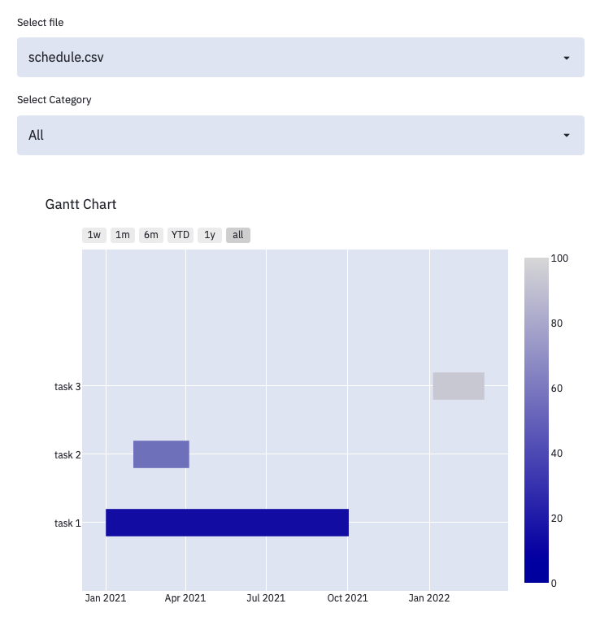

# gantt-stream-plot
Simple gantt chart using streamlit.



# Use
## install streamlit
pip install streamlit

## Store csv in schedule directory
schedule/**.csv

## csv header
header = ['Task', 'Start', 'Finish', 'Category', 'Complete']

||Task|Start|Finish|Category|Complete|
|--|--|--|--|--|--|
|format|str|YYYY-MM-DD|YYYY-MM-DD|str|int|
|example|Task 1|2021-08-02|2021-08-03|Research|50|

## run
```bash
streamlit run plot.py
```
# Ref

## Plotly doc
https://plotly.com/python/gantt/

## Qiita
https://qiita.com/keisuke-ota/items/a18f158389f1585a9aa0

https://qiita.com/Ringa_hyj/items/d5dba7592b63d59ad6e1
